# Page Layout Patterns

The following patterns are provided as guidelines for how to structure app content and navigation. These layout patterns work for most content, but there will be rare cases that require a custom layout.

## App structure

### App sidebar

The app sidebar is the top-level navigation menu for the app. The links in the sidebar may be arranged in a flat structure, or nested by category. The sidebar may also contain information that would normally appear in a footer.

### App header bar

The app header bar contains the app's name, logo, and content that relates to the global state of the app.

### Main content area

This is the focal point for app content and interactions. The content and it's layout is dynamic depending on which page a user navigates to.

### App status info area

In rare cases, a global message will need to be displayed about the state of the app. For example: informing the user that their connection to the backend has been interrupted.

## Page structure

There are a few common layouts that are used for page content. Most of these layouts are rendered in the main content area. However, pages that warrant a great deal of focus from the user are rendered without a sidebar or header bar.

### Page header

The page header informs the user which page they're on. It often displays the name of the page, and it may contain content and interactive components that are relevant to the rest of the page.

For more detailed information about page header usage, see the Storybook documentation for the `PageHeader` component.

### Standard layout

The most common page layout has a sidebar, header bar, and a main content area with a page header. The content in the page header and the primary content area stretches to fill the available width.

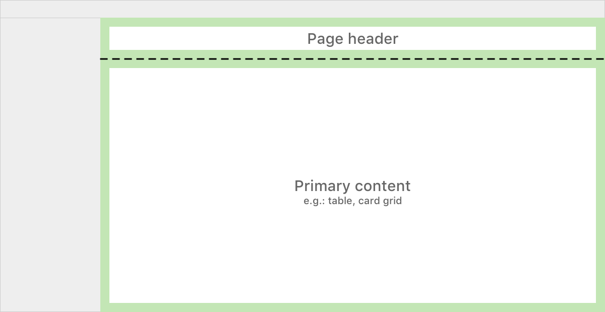

#### Primary content area

The primary content area can show anything, but it is most commonly a collection of related objects, or details about one specific object.

##### Primary content actions

If there are actions that directly affect what is displayed in the primary content area, they go before the content they affect, but after the page header.

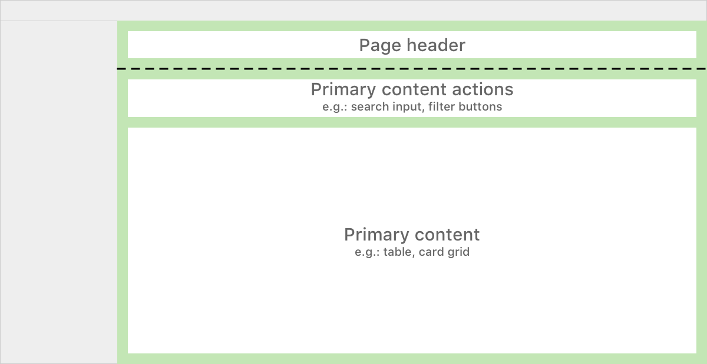

There are many possibilities for what interactive components can be used in the primary content actions area.

Action buttons are placed flushed to the right edge of the primary content area, and are ordered right-to-left from most important to least important.

If there are more than three actions, the two most important actions are placed to the left of an overflow menu.

If there are filters, they are flushed to the left edge of the primary content area.

If there is a text filter and an additional filter (e.g.: dropdown or segmented control), the text filter comes first.

#### Examples

##### Standard layout

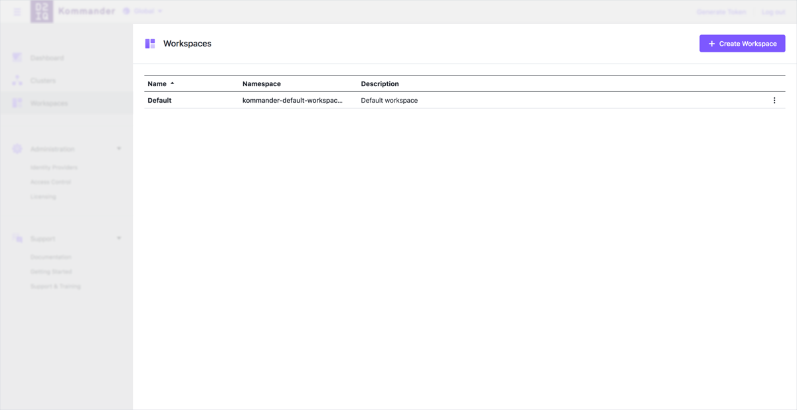

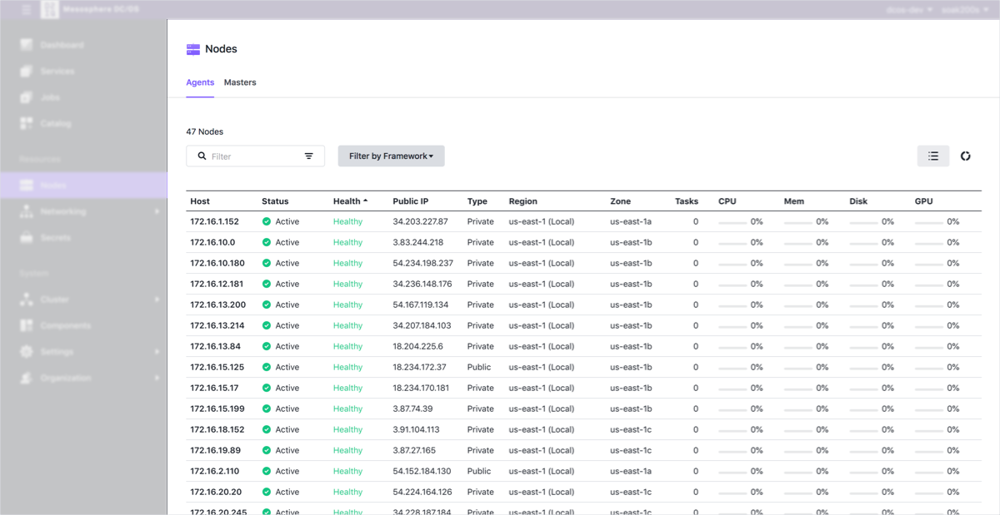

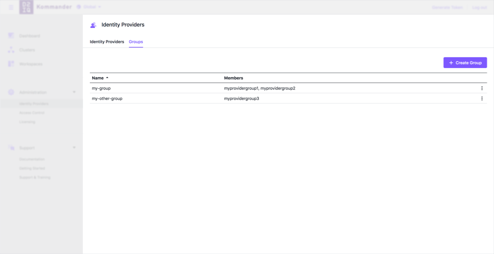

##### Primary content actions

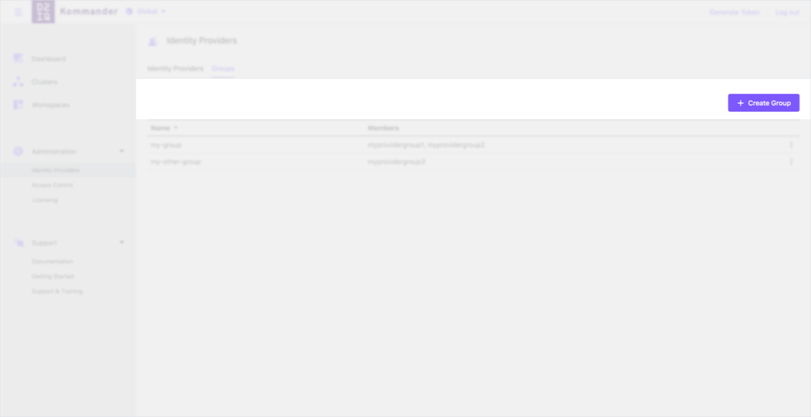

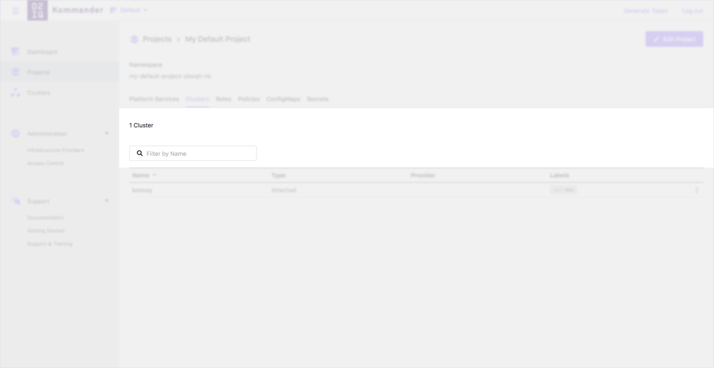

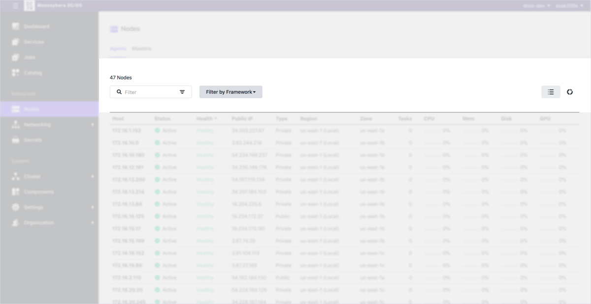

### Editorial layout

The editorial layout is just like the standard layout. The only differences are that the primary content is constrained to a maximum width, and the primary content doesn't typically have an action area. The maximum width is helpful for maintaining readibility for large blocks of text.

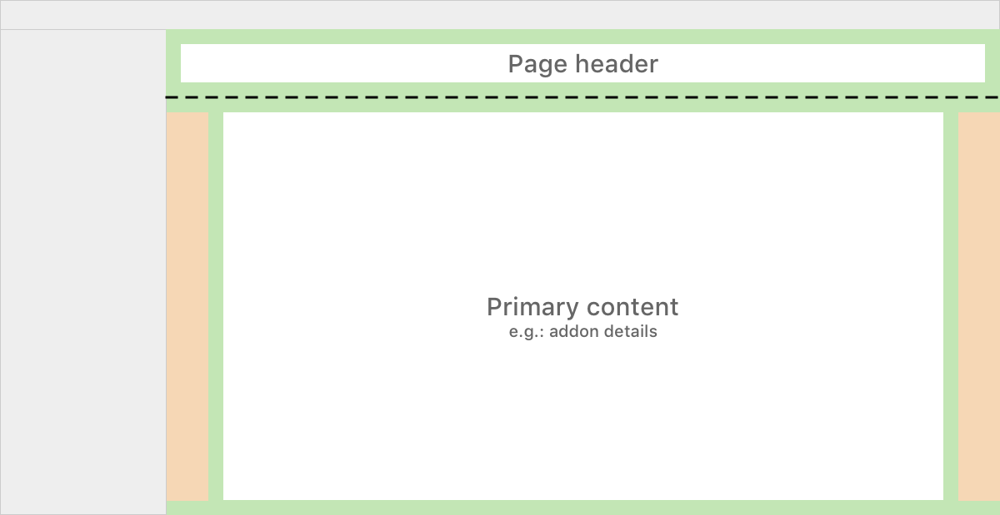

#### Examples

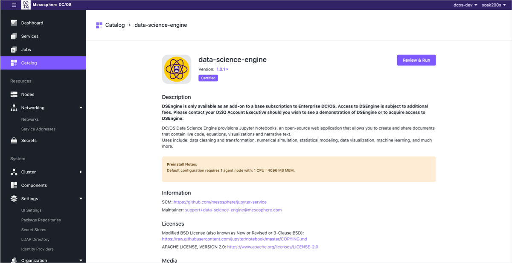

### Path selection layout

The path selection layout is used to when users need to make a selection to determine where they will be taken to complete their task.

The app header bar and app sidebar are hidden when users need to focus on choosing the appropriate path. A simple header may be used to show very basic info (e.g.: page title) and a button to cancel out of the flow.

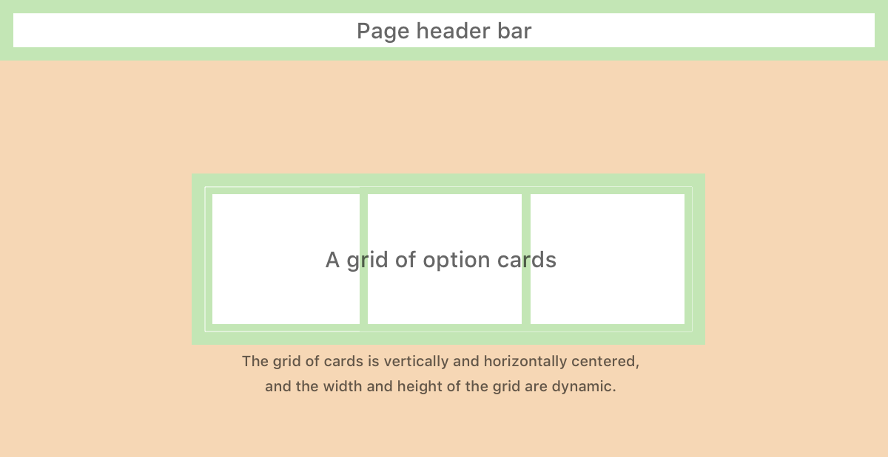

#### Examples

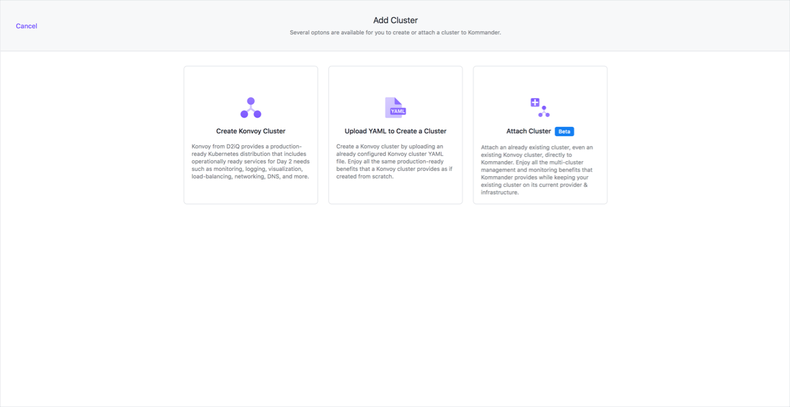

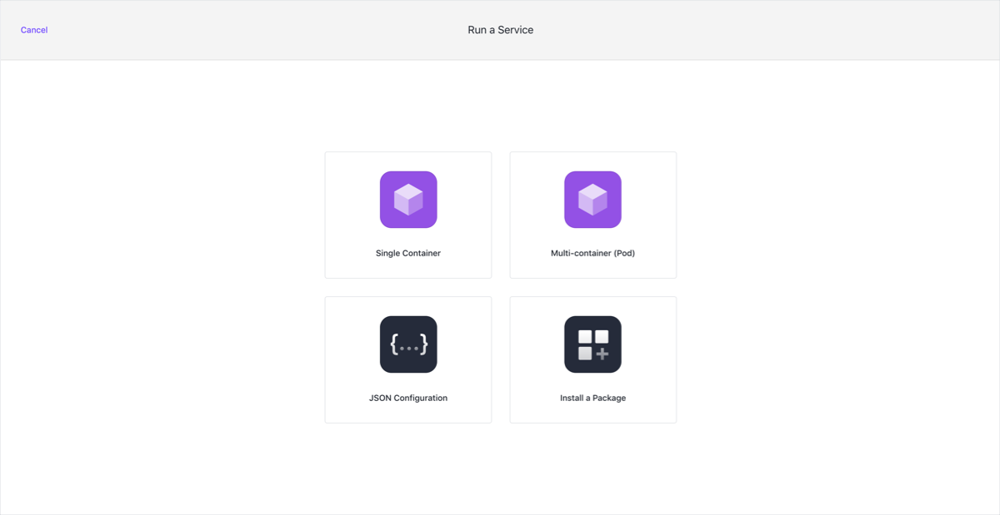

### Tabbed form layout

The tabbed form layout is used to display forms with multiple complex sections.

The app header bar and app sidebar are hidden when using this layout to allow users to focus on the complex form. A simple header may be used to show: very basic info (e.g.: page title), a button to cancel out of the form, and a button to submit the form.

#### Examples

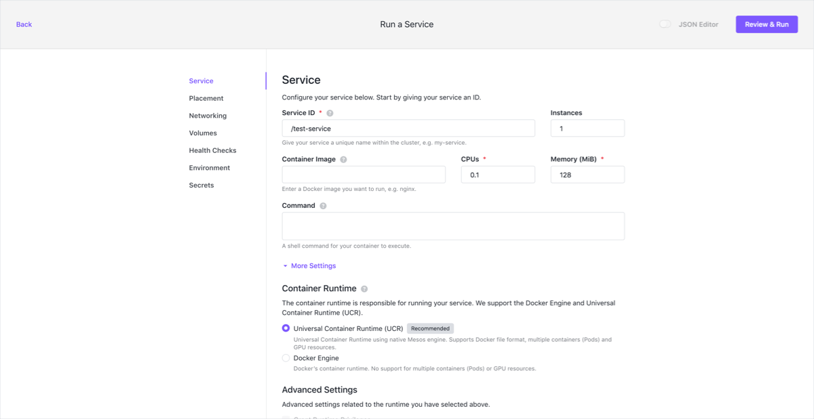

### Simple focused layout

The simple focused layout is used to present users with a simple task that needs to be completed before moving on to their next step in their session.

An optional header or footer may be shown to give users more context for completing their task.

#### Examples

